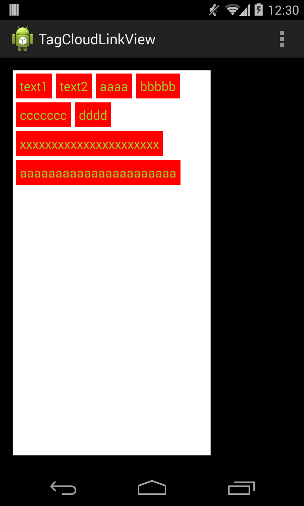
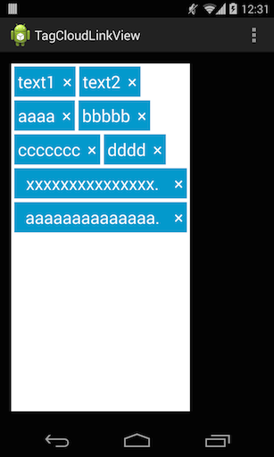

TagCloudLinkView
================

A Simple Layout with Tag View.

It provides add and remove Tag view.
(Tag object is packaged. 'com.ns.developer.tagview.entity.Tag')

It also can callback a selected tag text and deletable tag text ('×') .

 
  
   

Installing
----

###Gradle
```java
dependencies {
    compile 'com.ns-developer:tagcloudview:0.1.0'
}
```

Usage
-----
1.layout in xml

TagCloudLinkView provides a change deletable / undeletable tag or change layout color, text size, text color.

```xml
    <com.ns.developer.tagview.widget.TagCloudLinkView
        xmlns:app="http://schemas.android.com/apk/res-auto"
        android:id="@+id/test"
        android:layout_width="500px"
        android:layout_height="match_parent"
        android:padding="4dp"
        android:background="#ffffff"
        app:isDeletable="false"
        app:tagLayoutColor="#ffff0000"
        app:tagTextSize="8sp"
        app:tagTextColor="#ff9acd32"
        app:deletableTextSize="8sp"
        app:deletableTextColor="#ff9acd32"/>
```

2.add tag object

Example at Activity code.
```java
TagCloudLinkView view = (TagCloudLinkView) findViewById(R.id.xxx);
view.add(new Tag(1,"TAG TEXT 1"));
view.add(new Tag(1,"TAG TEXT 2"));
view.add(new Tag(1,"TAG TEXT 3"));
view.drawTags();
```

ex1. set text select listener

Example at Activity code.
```java
view.setOnTagSelectListener(new TagCloudLinkView.OnTagSelectListener(){
    @Override
    public void onTagSelected(Tag tag, int i) {
        // write something
    }
});
```

ex2. set delete event listener

Example at Activity code.
```java
view.setOnTagDeleteListener(new TagCloudLinkView.OnTagDeleteListener() {
    @Override
    public void onTagDeleted(Tag tag, int i) {
        // write something
    }
});
```

License
=======

    Copyright 2014 Namito.S

    Licensed under the Apache License, Version 2.0 (the "License");
    you may not use this file except in compliance with the License.
    You may obtain a copy of the License at

       http://www.apache.org/licenses/LICENSE-2.0

    Unless required by applicable law or agreed to in writing, software
    distributed under the License is distributed on an "AS IS" BASIS,
    WITHOUT WARRANTIES OR CONDITIONS OF ANY KIND, either express or implied.
    See the License for the specific language governing permissions and


